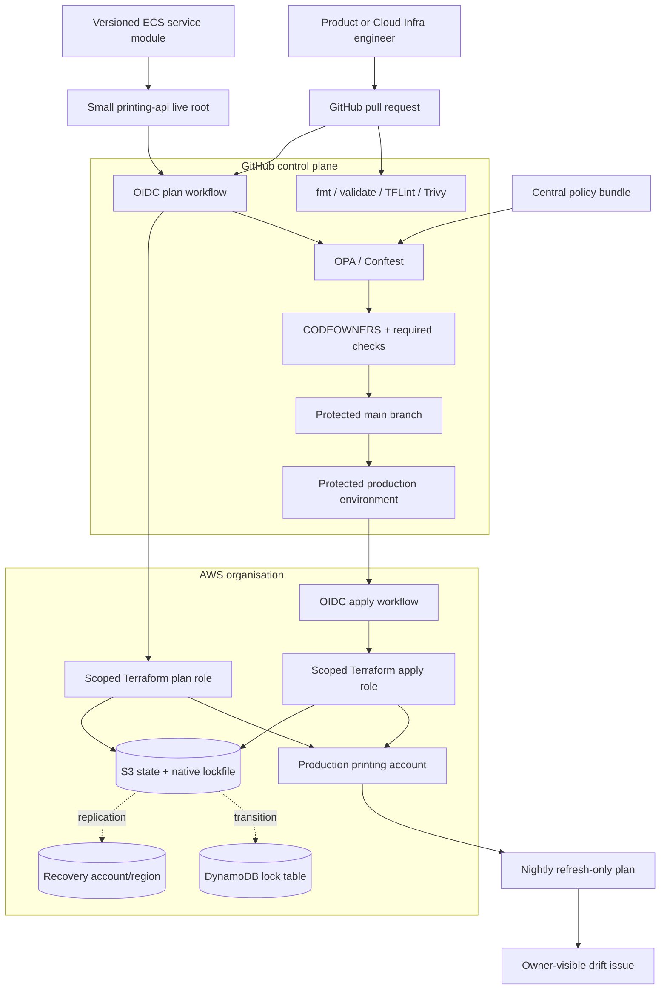

# Conceptual architecture

## Control-plane boundaries

- GitHub determines review and workflow orchestration.
- AWS IAM determines whether a workflow can read or change infrastructure.
- Terraform state is isolated per deployable root.
- Product teams own workload intent and service operations.
- Cloud Infra owns the paved road, privileged roles, shared policy, and foundations.
- Security and finance requirements are encoded as guardrails and feedback, not hidden review queues.
